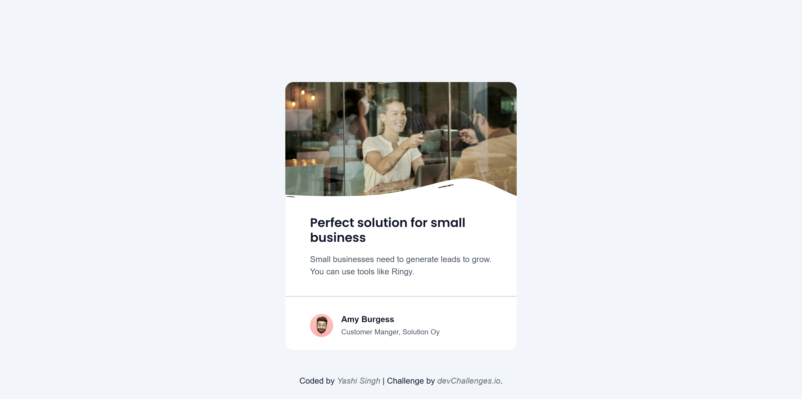
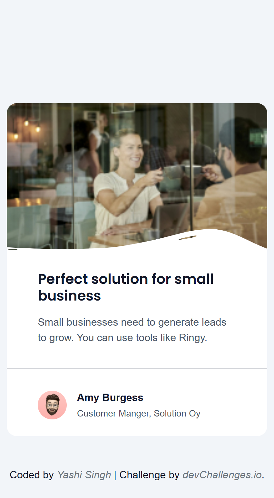

<h1 align="center">Business Blog Card | devChallenges</h1>

<div align="center">
   Solution for a challenge <a href="https://devchallenges.io/challenge/business-blog-card" target="_blank">Business Blog Card</a> from <a href="http://devchallenges.io" target="_blank">devChallenges.io</a>.
</div>

<div align="center">
  <h3>
    <a href="https://yashi-singh-9.github.io/Business-Blog-Card/">
      Demo
    </a>
    <span> | </span>
    <a href="https://devchallenges.io/solution/51619">
      Solution
    </a>
    <span> | </span>
    <a href="https://devchallenges.io/challenge/business-blog-card">
      Challenge
    </a>
  </h3>
</div>

---

## Table of Contents

- [Overview](#overview)
  - [What I learned](#what-i-learned)
  - [Useful resources](#useful-resources)
  - [Screenshot](#screenshot)
- [Built with](#built-with)
- [Features](#features)
- [Getting Started](#getting-started)
- [Acknowledgements](#acknowledgements)
- [Author](#author)

## Overview

A clean, responsive business blog card built with HTML, Stylus, and Bootstrap. The card features a business promotion message, author info, and responsive image handling.

### What I learned

- How to integrate Stylus for clean, nested CSS syntax
- How to use Bootstrap for responsive utilities
- How to combine custom CSS with a framework efficiently
- Improved understanding of semantic HTML5 structure

### Useful resources

- [Stylus Documentation](https://stylus-lang.com/docs/)
- [Bootstrap 5 Docs](https://getbootstrap.com/docs/5.3/getting-started/introduction/)
- [MDN Web Docs](https://developer.mozilla.org/) - Always helpful for HTML/CSS clarification

### Screenshot

**Desktop Design**


**Mobile Design**  


## Built with

- Semantic HTML5 markup
- Stylus (CSS preprocessor)
- Bootstrap 5
- Flexbox
- Responsive Design Techniques

## Features

- Fully responsive layout
- Clean and modern card UI
- Adaptive images using `<picture>`
- Stylus for maintainable CSS
- Bootstrap for spacing and layout utilities

## Getting Started

### Prerequisites

- [Node.js](https://nodejs.org/)
- [Stylus](https://stylus-lang.com/)

### Installation

1. Clone the repo

```bash
git clone https://github.com/Yashi-Singh-9/Business-Blog-Card.git
cd Business-Blog-Card
```

2. Install Stylus globally (if not already installed)

```bash
npm install -g stylus
```

3. Run the Stylus compiler to convert `.styl` to `.css`

```bash
stylus styles/style.styl -o styles/
```

4. Open `index.html` in your browser

## Acknowledgements

* [DevChallenges.io](https://devchallenges.io/) for the challenge
* [Bootstrap](https://getbootstrap.com/)
* [Stylus](https://stylus-lang.com/)

## Author

* LinkedIn [Yashi Singh](https://www.linkedin.com/in/yashi-singh-b4143a246)

